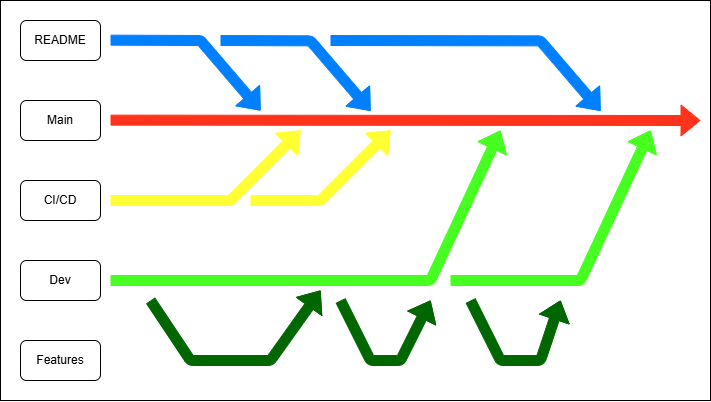

# Portfolio
Ce dépôt contient le code source de mon portfolio web, ainsi que toute la démarche technique liée à sa mise en ligne :  
*configuration serveur, intégration continue, pipeline CI/CD et déploiement.*  
L’objectif est de présenter mes compétences et mes projets tout en documentant la chaîne complète de développement et d’hébergement du site.
## Sommaire
* [Hérbergement](#Hébergement)
  * Choix de l'hébergeur
  * Configuration du serveur
* [Workflow](#Workflow)
  * Gestion des secrets
  * Mettre en place le workflow
  * Automatisation des tests
  * Automatisation du déploiment
* [Structure du projet](#Structure-du-projet)
## Hébergement
Pour l'hébergement, j'ai choisi de ne pas utiliser `github site` afin de pouvoir apprendre la gestion d'un serveur.  
Pour cela il a fallu trouver un hébergeur.
### Choix de l'hébergeur
J'ai choisi de travailler avec des instances `oracle cloud`.  
En effet ces instances présentent plusieurs points positifs : 
* Dans un premier temps, celles-ci allaient me permettre de réaliser ce que je voulais.
* Ensuite, la gratuité de l'offre *Always free* rend cette solution idéale.
---
L'instance avec laquelle j'ai choisi de travailler possède la configuration suivante :

| Nom | valeur |
| --- | --- |
| Shape | VM.Standard.E2.1.Micro |
| OCPU count | 1 |
| Network bandwidth (Gbps) | 0.5 |
| Memory (GB) | 1 |
| Storage (GB) | 47 |
| OS | Ubuntu 22.04.5 LTS |

### Configuration du serveur
Par la suite il a fallu configurer l'instance pour qu'elle puisse héberger un site web.
#### Installation du service
Pour le web serveur j'ai choisi `Ngnix` simple à configurer et à déployer.  
```console
sudo apt update
sudo apt install nginx
```
Ou en une ligne
```console
sudo apt update && sudo apt install nginx -y
```
À ce stade, nous avons la page d'accueil d'Nginx en [http://localhost:80](http://localhost:80)  
Nous allons maintenant voir comment exposer ce site sur internet.

#### Exposition du Port 80
Pour exposer le Port 80 (*http*), il faut configurer l'instance à la fois via le paneaux de configuration `oracle` mais égalament via la connexion `ssh` (secure shell).  
*Si vous ne savez pas comment établir une connexion SSH, allez voir [ici](https://docs.oracle.com/en-us/iaas/Content/Compute/tutorials/first-linux-instance/overview.htm#connect-to-vm-instance)*.  

---
**Configuration Oracle**  
Une fois dans votre instance, il faut suivre ce chemin :  
*Networking > Subnet > Sécurity > Default Security List for [subnet-name] > Security rules*  
Il faut maintenant ajouter une `Ingress Rules` afin d'autoriser la connexion au port 80.

| Nom | Valeur |
| --- | --- |
| Source Type | CIDR |
| Source CIDR | 0.0.0.0/0 |
| Ip Protocole | TCP |
| Source Port Range | All |
| Destination Port Range | 80 |
| Description | Votre_Description |

**Configiration SSH**  
Une fois connecté en SSH, il faut autoriser les connexions au port 80.  
Pour cela, exécutez la commande : 
```console
sudo iptables -I INPUT 6 -m state --state NEW -p tcp --dport 80 -j ACCEPT
sudo netfilter-persistent save
```
---
Vous pouvez désormais récuperer l'adresse ip public de votre instance, dans les details de votre instance, pour accéder à votre page web (*qui est pour le moment la page d'acceuil de Nginx*).

## Workflow
## Structure du projet
### Structure du dépot
```
📁 Portfolio/
├── 📂 site/
│   ├── 📂 html
│   ├── 📂 images
│   ├── 📂 style
│   └── 📂 scripts
├── 📂 .github/
│   └── 📂 workflow
├── 📂 README/
│   └── 📂 images
├── LICENCE
└── README.md
```
### Structure des branches
L'optique de ce projet est également de mettre en place des bonnes pratiques de DevOps avec une organisation particulière des branches.  
Nous aurons quatre catégories de branches : 
* la branche main
* la branche de développement (Dev)
* La branche de CI/CD
* la branche de documentation (README)

  
*Schéma représentatif du git flow*
