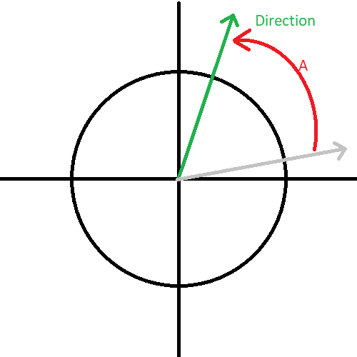
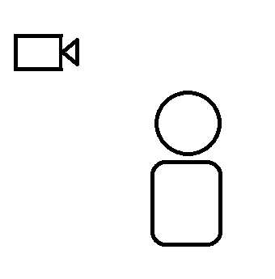
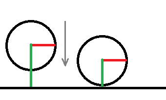
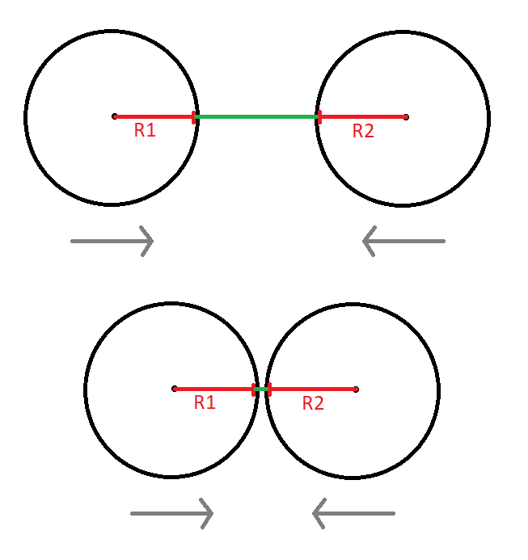
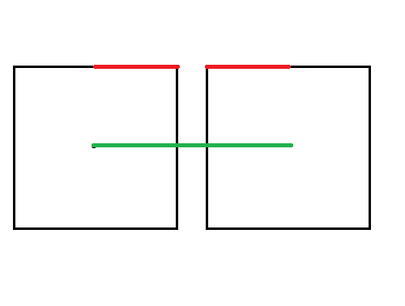
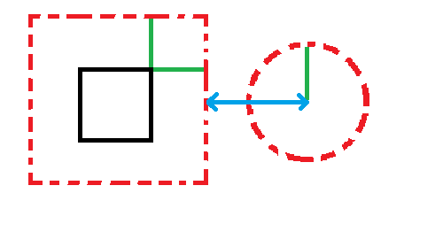
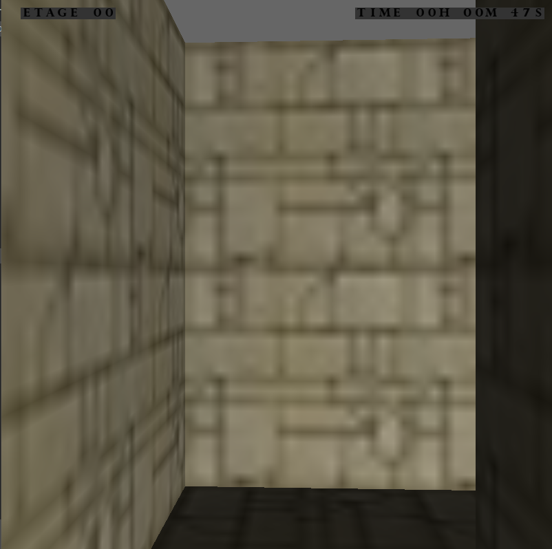

# La tour du Labyrinthe

  

La tour du Labyrinthe est un jeu video 3D de type **labyrinthe** où l'objectif est d'arriver en haut de la tour.  
Celui-ci a été réalisé dans le cadre du module TSI *(traitement et synthèse d'image)*.
## Sommaire
* [Context](#Context)
  * [Consignes](#Consignes)
  * [Idée de jeu](#Idée-de-jeu)
* [Développement](#Développement)
  * [Objet 3D](#Objet-3D)
  * [Déplacement](#Déplacement)
  * [Gestion de la caméra](#Gestion-de-la-caméra)
  * [Collisions](#Collisions)
  * [Création du labyrinthe](#Création-du-labyrinthe)
  * [Utilisation de texte](#Utilisation-de-texte)
  * [Gestion du son](#Gestion-du-son)
* [Jeu](#Jeu)
  * [Lancement](#Lancement)
  * [objectif](#objectif)
  * [Commandes](#Commandes)

## Context
Dans le cadre du module TSI *(traitement et synthèse d'image)* nous avons eu un projet nous demandant de réaliser un jeu en 3D afin de saisir les tenants et aboutissants de la synthèse d'image en 3D.  
Ainsi au cours de quelques TP nous avons appris les rudiments de cet art via **python** et le module d'**OpenGL** qui lui est associé.  
Finalement à l'issue de ces TP, nous pouvions nous lancer sur le développement de ce jeu.
### Consignes
Les consignes de ce projet étaient les suivantes:  
Réalisez un jeu 3D minimaliste avec une personne vue à la 3e personnes navigue dans un monde 3D.  
Le sujet de votre jeu est libre mais doit contenir au moins deux programmes graphiques différents, des interactions utilisateurs et aussi la réutilisation intelligente d’objets (affiché plusieurs fois).  
Remarques On rappelle qu’une rotation s’applique toujours autour de l’origine, il est donc nécessaire de translater l’objet si on souhaite faire tourner celui-ci autour d’un autre point tel que son centre par exemple.  
* Faites des choses simples dans un premier temps.
* Prêtez une attention particulière aux déplacements de vos objets ainsi qu’au déplacement possible de votre caméra. Définissez vos repères et faîtes des schémas.
* Dans le cas de la gestion des collisions réfléchissez comment détecter de manière approximative celles-ci.
### Idée de jeu
Nous avons donc choisi de faire un jeu autour d'un labyrinthe qu'il faudrait gravir afin de gagner la partie. Ce jeu est à la 3 ème personne mais pour des soucis de visibilité dans le labyrinthe nous avons décidé de ne pas afficher le personnage et de placer la caméra juste derrière lui. 
Chaque étage du labyrinthe se complexifie pour atteindre le 11ème étage qui est le plus difficile. Des pièges aparraissent petit à petit, ce sont notamment des trous ou 
des blocs par dessus lesquels il faut sauter.
## Développement
Nous allons détailler ici les différentes étapes et les concepts constituant notre travail.
### Objet 3D
Tout d'abord il a fallu comprendre comment construire un objet en 3 dimensions.  
Pour cela il faut dans un premier temps créer avec openGl et des programmes de vertex shader et de fragment shader un programme afin de faire la liaison entre l’écran, le GPU et python.
Nous avons donc les deux programmes **phong.vert** et **phong.frag**.
Ensuite afin de créer des objets 3D nous avons dû les définir. C'est-à-dire leur donner des sommets ainsi que des indices nous permettant de savoir comment relier ces sommets. De plus afin de prendre en compte la lumière il faut définir une normale, et finalement une couleur.  
  
Ensuite il faut arriver à faire une projection de sorte à ce que les objets affichés en 2D à l'écran nous paraissent être en 3D.  
Finalement une caméra est ajoutée pour que les projections se fassent par rapport à celle-ci.
### Déplacement
Pour ce qui est du déplacement nous avons deux possibilités :
* avancer et reculer
* tourner selon l'axe des y  
  
Une fois que l'objet a tourné il avancera dans la direction qu'il regarde. Pour cela nous devons utiliser un vecteur de direction indiquant dans quelle direction notre objet regarde. Une fois ce vecteur mis à jour nous pouvons avancer dans cette direction.  

*Exemple de rotation de la direction*  

De plus chacun de nos objet, même s'il ne s'agit pas du joueur, doit bouger pour se positionner à sa place.  
### Gestion de la caméra
Pour que notre jeu soit à la troisième personne la caméra suit les déplacements et l'orientation de notre objet principal qui sera plus tard le joueur.  
Pour cela nous devons récupérer la position du joueur ainsi que sa direction puis reculer un peu pour que la caméra se situe derrière le joueur.

  
*vue de la caméra*  
Cependant dans notre contexte de labyrinthe la proximité avec les murs rend l'affichage du joueur problématique.  
En effet si on affiche le joueur nous devons nous positionner derrière celui-ci ce qui nous fait parfois rentrer dans les murs.  
Pour palier ce problème nous avons choisi de ne pas afficher le joueur et de rapprocher la caméra.  
### Collisions
Il y a plusieurs types de collisions, les collisions avec un plan, entre deux sphères ou entre des cubes.

Pour gérer les collisions avec un plan, on calcul simplement la distance entre le centre de l'objet et son bord, puis la distance entre le centre et le plan. Si la
soustraction est nulle on détecte la collision et on recule l'objet dans la direction d'où il est venu.
  

  
*schéma collision plan*  

Les collisions entre 2 sphères utilisent le même principe. On calcul le rayon de chaque sphères puis on les soustraits à la distance séparant les deux centres. En fonction
du résultat, on recule les sphères ou non.

  
*Schéma collision sphères* 

Les collisions entre 2 cubes on reproduit le même schéma. En premier le calcul de la taille des objets et ensuite la vérification de la collision puis la correction. Elles nous sont utiles pour pouvoir vérifier que les cubes des murs se touchent mais ne rentrent pas les uns dans les autres.
  

  
*Schéma collision cubes*  

Enfin, les dernières collisions importantes sont les collisions sphères cubes. en effet notre personnage est représenté par une sphère et les murs sont des cubes, il est donc important de pouvoir vérifier que le personnage n'entre pas dans les murs. Pour détecter cette collision,on commence par ajouter à notre cube le rayon de la sphère. Ensuite, par rapport à ces nouvelles limites, on regarde si on est en contact avec le centre de la sphère. En fonction on réajuste la distance ou non.

  
*Schéma collision cube_sphère*  
### Création du labyrinthe
Le labyrinthe est composé d'un total de 11 étages. Chaque étage est unique, les sorties et les entrées sont placées à des endroits différents pour chacun.
Pour créer le labyrinthe nous avons d'abord créer la **map**. C'est un fichier texte dans lequel les étages sont dessinés. Chaque élément du labyrinthe a un symbole spécifique:
* les murs : #
* un bloc de pierre : 1
* deux blocs de pierre : 2
* la sortie pour atteindre l'étage suivant : S
* un trou / une entrée : J

Le programme vient simplement lire le fichier texte et génère les étages comme décrit par le plan. Il est donc relativement simple de modifier les plans à loisir.
### Utilisation de texte
Pour ce qui est de l'utilisation de texte, ni openGL ni glfw ne fournie une méthode. Il faut donc tout implémenter nous même.
    
Nous avons donc dû créer des textures (*une pour chaque caractère que nous voudrons utiliser*), puis créer une classe pour gérer l'affichage d'une suite de caractères.
  
  
*exemple de texture*  
  
  
Cette classe doit être initialisée au tout début avec les autres objets 3D car il s'agit de plan sur lesquels on met une texture. Sa taille est donc inchangeable mais les caractères peuvent changer. 
  
Finalement comme nous voulons que ces textes s'affichent toujours devant la caméra, nous devons les afficher juste après l'envoie de ces informations au vertex shader.
### Gestion du son
Le son a été ajouté au jeu et gérer grâce à du multiprocessing.
Pour commencer on crée un sémaphore avec 3 jetons, permettant de contrôler que seulement 3 sons maximum peuvent jouer en même temps.
Ensuite on associe à chaque fonction son, un processus.
Le fait d'utiliser du multiprocessing pour le son permet une chose essentielle : le son joue en **paralèlle** de la gestion du jeu. On peut donc continuer de parcourir le labyrinthe en profitant de la musique de fond. Deuxième avantage, il permet d'avoir d'autres sons jouant en même temps.
C'est grâce au multiprocessing qu'on peut avoir une musique de fond et de temps en temps, avec une chance de 1 sur 400,un bruit qui vient se supperposer à l'ambiance du jeu pour renforcer le côté angoissant et surprendre le joueur.

Pour éviter d'avoir à installer une librairie, nous avons chercher une librairie native de python et avons trouvé la librairie **winsound**. C'est une librairie au fonctionnement basique mais qui nous suffit pour jouer nos sons. Elle offre également la possibilité de jouer les sons en 'non synchronisés' avec le paramètre 
'winsound.SND_ASYNC'. C'est cette fonctionalité qui nous a permis d'utiliser le multiprocessing.
Chaque son a été téléchargé et est libre de droit. Comme la librairie ne permet pas de modifier le volume sonore, toutes les musiques de fond ont été préalablement modifiées pour réduire leur volume sonore de 70%. Cela permet de ne pas avoir tout les sons qui jouent au même volume et de pouvoir les distinguer.
## Jeu
Au pied d’une tour oubliée, vous vous réveillez, seul, face à un défi aussi simple qu’implacable : gravir les étages d’un labyrinthe sans fin. Ici, pas de monstres à affronter, ni de murs mouvants… seulement le silence, la pierre froide, et des pièges sournois qui attendent la moindre erreur.

Chaque étage est un casse-tête. Chaque détour, une menace. Votre seul objectif : trouver la sortie, étage après étage, jusqu’au sommet.

Aurez-vous l'esprit assez affûté — et les nerfs assez solides — pour échapper à la Tour du Labyrinthe ?
  
  
  
*Vue du jeu*
### Lancement
Pour lancer le jeu il faut dans un premier temps veiller à avoir activé un environnement virtuel comprenant les librairies du `requirement.txt` (*même que celles de TP*).  
  
De plus si vous désirez avoir le son il faut **impérativement être sous windows**. En effet la librairie utilisée pour le son est installée de base sous windows et ne marche que sous ce système d'exploitation.  
Pour les autres, le jeu reste jouable sans son.

Pour lancer une partie il suffit d'executer avec python le fichier main.py
### Objectif
L'objectif de ce jeu est simple: **arriver en haut de la tour**.
Pour cela vous devrez à chaque étage trouver votre chemin dans un labyrinthe semé d’embûches.
### Commandes
Les commandes sont simples :
* Flèche du haut -> avancer.
* Flèche du bas -> reculer.
* Flèche de droite -> tourner vers la droite.
* Flèche de gauche -> tourner vers la gauche.