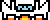
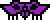
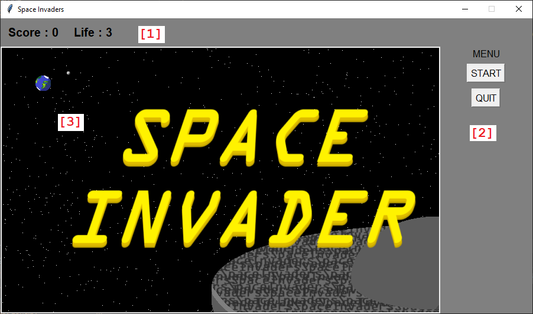
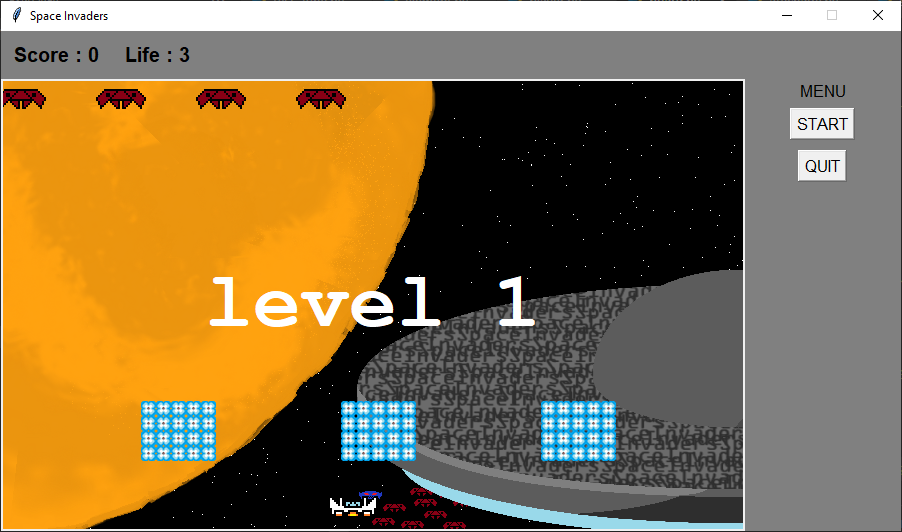

# tp-space-invaders-calamel-ly-michaux  
**tp-space-invaders-calamel-ly-michaux** créé par GitHub Classroom  
**Link** : [https://github.com/cpe-lyon/tp-space-invaders-calamel-ly-michaux](https://github.com/cpe-lyon/tp-space-invaders-calamel-ly-michaux)

# Sommaire  
* [Présentation](#Présentation)
* [Règles du jeu](#Règles-du-jeu)
* [Comment Jouer](#comment-jouer)
* [Code](#Code)
  * [Entité](#Entités)
  * [Vue](#Vue)
  * [Contrôle](#Controle)
* [Implémentation des listes](#Implementation-des-listes)
* [TODO](#TODO)
 

# Présentation  
Ce projet est une réplique du célèbre jeu **SpaceInvaders**, sorti en 1978 sur bornes d'arcade.  
Il a pour objectif de manipuler la PO (Programmation Orientée Objet).  
Ce projet a été réalisé par deux auteurs :  
* [Ethan LY-MICHAUX](https://github.com/CPEthan)  
* [Martin CALAMEL](https://github.com/MartinCalamel)

>Space Invaders proved that video games could be a worldwide cultural phenomenon, captivating audiences beyond the arcades.  
>**David Kushner**

# Règles du jeu  
Une partie se déroule sous forme de niveaux (*Levels*).  
À chaque niveau, votre vaisseau (*fig_1*) est attaqué par des aliens (*fig_2*).  

|  |  |  
| --- | --- |  
| *fig_1* | *fig_2* |  

Le but du jeu est d'éliminer tous les aliens.  
Les aliens, quant à eux, attaquent en tirant des missiles qui vous infligent des dégâts (*1 vie*).  
Vous avez un total de **3 vies**.  
Pour terminer un niveau, il faut éliminer tous les aliens de celui-ci.  
Plus vous montez dans les niveaux, plus la difficulté augmente.  

Au cours de votre progression, vous allez rencontrer **3 types d'aliens** avec chacun leurs caractéristiques :  

| Image | Type | Vie | Peut tirer | Récompense |  
| --- | --- | --- | --- | --- |  
|  | 1 | 1 | Oui | 25 |  
|  | 2 | 2 | Oui | 50 |  
|  | 3 | 3 | Non | 75 |  

# Comment jouer
Afin de jouer a **SpaceInvader** il faut avant tout lancer le programme:
placer vous dans le répertoire général et lancer la commande:
```
python3 main.py
```
Une fois le programme ouvert, il faut lancer une partie en cliquant sur le bouton start

Lors de la partie utiliser les flèches (*gauche et droite*) afin de vous déplacer sur l'ecran et la barre d'espace pour tirer.

# Code  
Voyons maintenant comment ce jeu s'articule :  

### Organisation  
Étant donné que ce projet est programmé en PO (Programmation Orientée Objet), il possède donc une organisation particulière.  
Tout d'abord, nous utilisons le modèle VCE (Vue-Contrôleur-Entités) pour organiser le développement.  

Ce modèle fonctionne de la façon suivante :  
- **Vue** : Gère l'affichage et les interactions utilisateur.  
- **Contrôleur** : Intermédiaire entre la Vue et les Entités, applique la logique métier.  
- **Entités** : Représentent les données et règles métier.  

Appliqué à notre projet, cela donne :  
* Un dossier pour les classes liées à la Vue : [dossier](https://github.com/cpe-lyon/tp-space-invaders-calamel-ly-michaux/blob/main/graphic)  
* Un dossier pour les classes liées aux Entités : [dossier](https://github.com/cpe-lyon/tp-space-invaders-calamel-ly-michaux/blob/main/Classes)  
* Un fichier pour le contrôle global : [fichier](https://github.com/cpe-lyon/tp-space-invaders-calamel-ly-michaux/blob/main/board.py)
 
## Entités
Pour les Entités, nous avons créé une classe générale appelée [Element](https://github.com/cpe-lyon/tp-space-invaders-calamel-ly-michaux/blob/main/Classes/element.py). Toutes les Entités du jeu héritent de cette classe.  

Parmi les Entités, nous avons :  
* Les vaisseaux (*le joueur et les aliens*)  
* Les missiles (*tirés par le joueur ou les aliens*)  
* Les murs  

Chacune de ces Entités possède des caractéristiques communes :  
* Une position  
* Une vitesse (*même si elle est nulle*)  
* Une direction de déplacement (*peut être nulle si l'entité ne se déplace dans aucune direction*)  
* Une taille (*largeur, hauteur*)  
* Un nombre de vies  
* Un tag (*pour identifier l'entité*)  
* Une kill list (*pour savoir quelles entités elle peut détruire*)  

Comme les positions fonctionnent avec un système de coordonnées et doivent être mutables et ordonnées, nous utilisons une structure de données adaptée pour pouvoir les modifier et récupérer les indices `x` ou `y`.  
Les positions sont donc des listes de la forme `[x, y]`, et d'autres attributs partagent cette même structure.  

C'est le cas de :  
* La vitesse (*vitesse selon x, vitesse selon y*)  
* La direction (*direction selon x, direction selon y*)  

Ainsi, nous pouvons construire une méthode de déplacement associée à chaque **Elément**.

```
def move(self) -> int:
    for i in range(2):
        self.pos[i] += self.direction[i] * self.speed[i]
    return 0
```

La taille nous permet de définir une hitbox de chaque élément elle tiendra aussi compte de la position et permettra par la suite de détecter les collisions  
Nous avons donc créer une méthode afin de la récupérer les deux coins (*supérieur gauche* et *inferieur droit*)
```
def hit_box(self) -> tuple:
    return (
        self.pos[0] - (self.width // 2) + 0.3*self.width,  # xmin
        self.pos[1] - (self.height // 2) + 0.3*self.height, # ymin
        self.pos[0] + (self.width // 2) + 0.3*self.width,  # xmax
        self.pos[1] + (self.height // 2) + 0.3*self.height, # ymax
        )
```
Ici le couple *xmin*,*ymin* sont les coordonnée du coin **supérieur gauche** et *xmax*,*ymax* le coin **inferieur droit**

### Spaceship  
Héritant des méthodes et attribut des **Eléments**, les Spaceships ont une classe qui leur est propre : [Spaceship](https://github.com/cpe-lyon/tp-space-invaders-calamel-ly-michaux/blob/main/Classes/spaceship.py).  
Parmi les Spaceships nous avons:  
* les aliens
* le Player

Chacun de ce vaisseau possède, en plus de ceux de la classe Elément des attributs commun au vaisseaux :  
* reload
* shooting_ship
* reload_time

`reload` et `reload` time permette d'empêcher un vaisseau de tirer en continue en lui imposant un temps minimal entre chaque tire.
`shooting_ship` quand a lui permet de savoir si le vaisseau est un type qui qui tire.

Ces attributs s'articule dans deux méthode que voici :
```
def can_shoot(self) -> bool:
    return time()-self.reload >= self.reload_time and self.shooting_ship
```
*Vérifie que le vaisseau peut tirer*
```
def shoot(self) -> int:
    self.reload:  float = time()
    return 0
```
*met a jour le temps minimal*

### Aliens
Les aliens comme le joueur hérite de la classe spaceship mais contrairement au joueur ils possèdent des attributs propre au aliens: [Alien](https://github.com/cpe-lyon/tp-space-invaders-calamel-ly-michaux/blob/main/Classes/alien.py)
* reward
* type  
`reward` est la récompense qu'offre un alien quand il est tué et `type` permet de construire les différents aliens.

### Missile et Wall
Les missile et le wall comme les spaceship hérite de la classe élément. Cependant ils ne possèdent pas leurs propres méthodes ou attributs.  
Ils on seulement des attributs prédéfinit là où les même attribut pour les vaisseaux ils sont en paramètre.

## Vue
Pour la vue nous avons créé une classe principal [Affichage](http://github.com/cpe-lyon/tp-space-invaders-calamel-ly-michaux/blob/main/graphic/affichage.py)

Cette classe nous permet de définir l'ensemble de la fenêtre. Elle ne possède pas de paramètre car ses attribut n'ont pas vocation à être initialiser.
Elle utilise la bibliothèque **Tkinter** de python.
La fenêtre (*fig_3*) possède plusieurs partie :
* le plateau de jeu [1]
* le menu [2]
* la barre d'information [3]


  

*fig_3*  
L'élément principal est le plateau de jeu.
### Le plateau de jeu
Le plateau de jeu est un Canvas de la bibliothèque **Tkinter** de python
```
self.playground = tk.Canvas(self.root,background="black")
self.playground.update()
```
Tous les objets du jeu auront une image qui sera placer sur ce plateau. Il est donc d'une importance capital.
De plus les objets d'un Canvas on des méthodes qui leurs permettent de se déplacer `mouve()` ce qui nous sera utile pour le mouvement de nos objets
Dans notre plateau nous aurons les 4 type d'objets vu précédemment : 
* Player
* aliens
* missile
* murs
Ainsi que le **background** (l'image de fond)

### La gestion des objets
Dans l'affichage nous gérons aussi les objets. La classe update met a jour les positions des objets a chaque tour de jeu.  
Elle met a jour 3 choses : 
* la position des missile
* la position des aliens
* le tir des aliens

les objets pour pouvoir être traiter facilement sont stocké dans une liste qui contiens tout les objets non joueur. Les fonction d'update n'ont besoin de travailler qu'avec les missiles et les aliens. Ainsi il faut avant tout sélectionner les aliens d'un coter et les missiles de l'autre. cela est possible grâce a la liste d'objets et le tag de chaque entité.
```
list_alien = [obj for obj in objets if obj[0].tag == "alien"]
list_missile = [obj for obj in objets if obj[0].tag == "missile"]
```
Nous pouvons ensuite appliquer les fonctions pour chacun des éléments.

### La gestion des tirs
#### Aliens
A chaque tour il faut que les aliens aient une certaine probabilité de tirer un missile. Pour ce faire dans la classe Shoot nous avons une méthode pour le tir des aliens.  
Celle-ci a une chance de **1/10** de piocher un alien pour le faire tirer. Si cet aliens est en capacité de tirer (*en fonction du temps de recharge ou de si le vaisseau en est un qui tir*) alors un missile est créé et celui-ci peut tuer le joueur.
```
 missile = Missile([0, 5], [alien.pos[0], alien.pos[1] + 20], direction=[0, 1], kill="player")
```
Comme nous pouvons le voir ici le missile hérite de la position de **l'alien qui le tir**, ira vers le bas *(sur Tkinter le bas et dans le sens des **y** positifs)*, et pourra tuer le joueur.

#### Joueur
Le joueur lui aussi peut tirer seulement c'est suite un évènement, ce que nous verrons plus tard. Identiquement aux aliens il faut vérifier le temps de rechargement avant de pouvoir tirer.  
```
missile = Missile([0, 5], [player[0].pos[0] + 15, player[0].pos[1] - 20], direction=[0, -1], kill="alien")
```
Comme nous pouvons le voir ici le missile hérite de la position du **joueur**, ira vers le haut *(inversement à précédemment sens des **y** négatifs)*, et pourra tuer les aliens

### Initialisation de la partie
Enfin avant que la partie puisse commencer il faut que les objets soient définit et les initialiser.  
Pour ce jeu il faut initialiser :
* les aliens
* le player
* le Canvas
* les murs

Toute les initialisations doivent se faire en fonction du niveau actuelle.

#### Les aliens
Les aliens sont initialiser par rangée de 4 aliens (*une rangée par niveau*) le type d'alien est le même pour toute la rangée. Par rangée ils sont définit de la façon suivante:
```
for j in range(4):
    alien = Alien(rangée % 3, 10, [4, 20], [100 * j + 20, 40 * rangée + 20], [1, 0])
```
la position `[100 * j + 20, 40 * rangée + 20]` dépend de la rangée et de la place de l'alien dans la rangée *j*  
#### le player
le player est initialiser de façon identique quelque soit le niveau. Il est positionné en bas au milieux du plateau et a toujours la même vitesse 
```
# fixer la position initial au centre de l'écran
pos_x = (self.affichage.playground.winfo_width() // 2) - 20
pos_y = self.affichage.playground.winfo_height() - 25

player = Player([10, 0], [pos_x, pos_y])
```
Comme le joueur ne peut pas se déplacer de haut en bas il a une vitesse de 0 selon *y*
#### le Canvas
A chaque initialisation il faut détruire tout les objets du Canvas, puis mettre a jour le fond d'écran en fonction du niveau.
```
for i in self.affichage.playground.find_all():
    self.affichage.playground.delete(i)
self.affichage.playground.create_image(0, 0, anchor="nw", image=self.affichage.backgroundIm[(level%3)+1])
```
#### Les murs
Les murs de même que le player ont une initialisation qui indépendante du niveau. Ils sont toujours placé au même endroits.  
Nous avons fait 3 îlot de *5x4* briques. (*fig_4*)  

  
*fig_4*  
Chaque brique n'a qu'une vie et de fait disparait une fois toucher par un missile.  
Tous les missiles qu'ils soient tirer par les aliens ou le joueur peuvent détruire les briques.

## Contrôle
Afin de lier les élément et l'affichage on utilise un programme spécifique : **le contrôleur**.
Ce programme est une classe qui vas pouvoir a la fois gérer les évènements et l'affichage mais aussi les attribut des éléments.
Cette classe possède de nombreux attribut. Nous allons en faire une liste exhaustive mais seulement les plus important serons expliquer.

### Attribut 
* Attribut lier au classe d'affichage:
  * affichage
  * update
  * move_joueur
  * shoot
* Attribut propre au objets :
  * object
  * aliens_direction
  * key_press
  * player
* Attribut lier a la partie:
  * niveau_run
  * player_alive
  * level
  * score


Les attributs propre au objets sont les plus important :  


Notamment **objet** qui contiens tout les objets non joueur (*aliens, missile, murs*).  
c'est une liste car elle doit pouvoir être parcourue et nous devons pouvoir sélectionner un élément pour le supprimer, récupérer des caractéristique,...  


**alien_direction** est un attribut car il est commun a tout les aliens comme toutes les direction de tous les objets c'est une liste de coordonnées *[x,y]*.


**key_press** est un atribut qui va permettre au joueur de tirer et se deplacer.  
 Il est utilisé pour palier au **délai de répétition** présent sur tous les claviers.

**player** évidement contient l'entité player ainsi que son object graphique.


Les attribut lier a la partie serons utiliser pour gerer les niveau et tours du jeu.
### Méthodes
#### Run
La méthode **run** permet de lancer l'application. Elle initialise le  bouton start afin qu'il puisse lancer la partie lorsqu’il est cliquer.

#### start
la méthode **start** lancer par un click sur le bouton *start* initialise le niveau de départ.  
Elle prend donc en paramètre le niveau de départ.  
Elle va initialiser toute la partie (*score, vie, objets, aliens_direction, player*).  
Elle va egalement ecouter les touches presser et relacher ainsi que desactiver le bouton start.  
finalement elle lance la methode qui va gerer les tours de la partie : **tick**

#### tick
La methode **tick** realise les étapes d'un tour avant de se rappeler si le jeu peu passer au tour suivant.  
Un tour consiste en plusieurs étapes :
* mettre à jour l'affichage de la vie du joueur
* mettre à jour la position des objet non joueur
* mettre à jour la position du joueur
* faire tirer les aliens
* Calculer les collisions et met a jour l'état du jeu (vie du joueur, fin du niveau, score)
*  mettre à jour le score dans l'affichage
*  tester à la fin le lancement d'un nouveau tour, le changement de niveau ou la fin de la partie

# Implementation des listes
En tèrmes de strucure de donnée nous avons choisi d'implementer des listes.  
En voici les utilisation:  
## Coordonée
Afin de pouvoir deplacer/repérer tous nos element dans l'espace nous avions besoin d'une structure de donnée mutable où l'on puisse selectionner un element précis comportant deux element:   
Nous avons donc choisi d'utiliser les listes comme ceci : **[x,y]**  

## kill list
Pour les elements afin d'indique les objets qu'ils peuvent tuer il faut une liste afin de pouvoir la parcourir

## objets
Tous les objets sont stocker dans une grande liste afin de pouvoir la parcourir, selectionner un object en particulier, ...  
De plus chaque object est lui même une liste avec respectivement **[entity,Canvas.object]** afin de pouvoir selectionner l'un ou l'autre.  
Idem pour le player.  

## key_press
Pour key_press la liste est essenciel pour nous fournire une pair [touche pressé, est-elle pressé] qui nous permet de recuperer la touche et si elle est effectivement pressé.

## Les niveaux
Afin de pouvoir selectionner les aliens et fond a mettre en place en fonction du niveau nous avons decider de les stocker dans des listes.  

## Le score
Le score aussi sera stocker dans une liste afin de pouvoir le trier par ordre décroissant.

# TODO
- [ ] Power Up : Bonus obtenus aléatoirement en tuant des énnemis, avec comme exemples :
  * 1 vie en plus
  * un missile explosif qui tue les aliens alentours
  * un bonus qui permet de tirer en raffale en maintenant espace pendant quelques secondes.
- [ ] Fonction pour la soucoupe bonus qui passe rapidement et qui donnerait plus de points que les autres.
- [ ] Menu pour changer les contrôles (déplacement et bouton de tir).
- [ ] Menu pour la selection du niveau
- [ ] Ajout de cheat code
- [ ] Augmenter la vitesse des aliens quand ils sont moins nombreux
- [ ] Ajouter un mode multijoueur
- [ ] complexifier les definitions de niveau (pas seulement plus d'aliens)